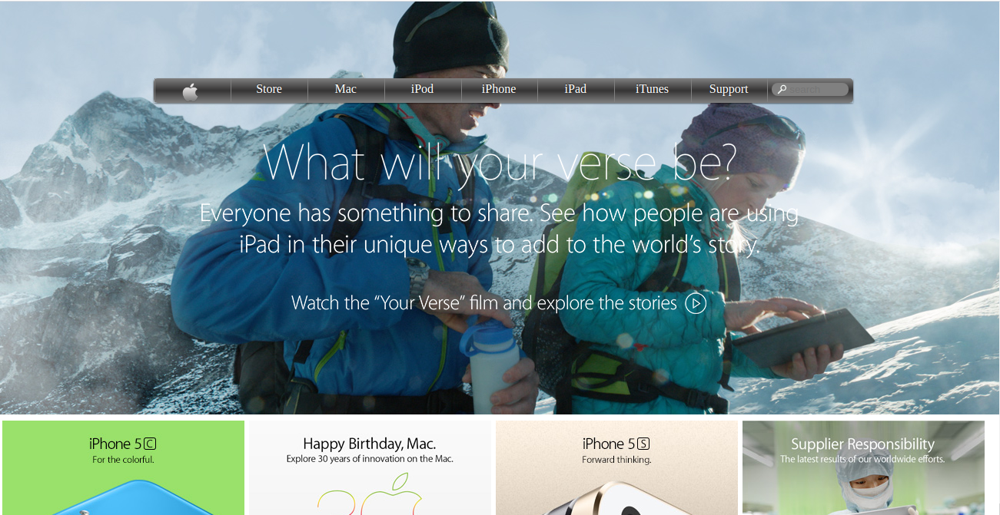

# Building-with-Backgrounds-and-Gradients
This project consists of building a webpage using images as a background and adding gradients to elements. The goal is to make a clone of old an old version of the Apple website webpage.

You can find the original project specification at: [Apple](https://www.theodinproject.com/courses/html5-and-css3/lessons/building-with-backgrounds-and-gradients)
[Apple](https://web.archive.org/web/20140301004610/http://www.apple.com/)

## Screenshot

 

## Technologies

- HTML 
- CSS

## Live Demo

[Live Demo Link](https://raw.githack.com/kobiyoyo/Images-video/master/index.html)

## Authors

👤 **Adama Chubiyojo Desmond**

-  [Github](https://github.com/kobiyoyo)
-  [Twitter](https://twitter.com/_kobiyoyo)
-  [Linkedin](https://www.linkedin.com/in/chubiyojo-adama/)
-  [Email](mailto:adamachubi@gmail.com)

## 🤝 Contributing

Contributions, issues and feature requests are welcome!

Feel free to check the [issues page](issues/).

## Show your support

Give a ⭐️ if you like this project!

## Acknowledgments

- Hat tip to anyone whose code was used
- Inspiration
- etc

## 📝 License

This project is [MIT](lic.url) licensed.
